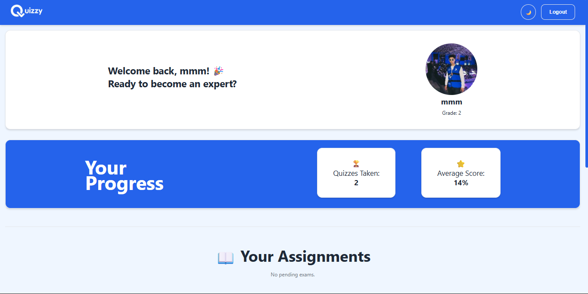
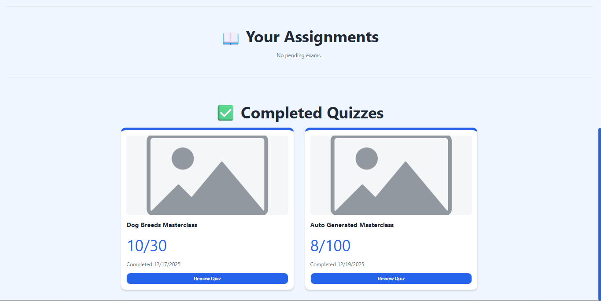
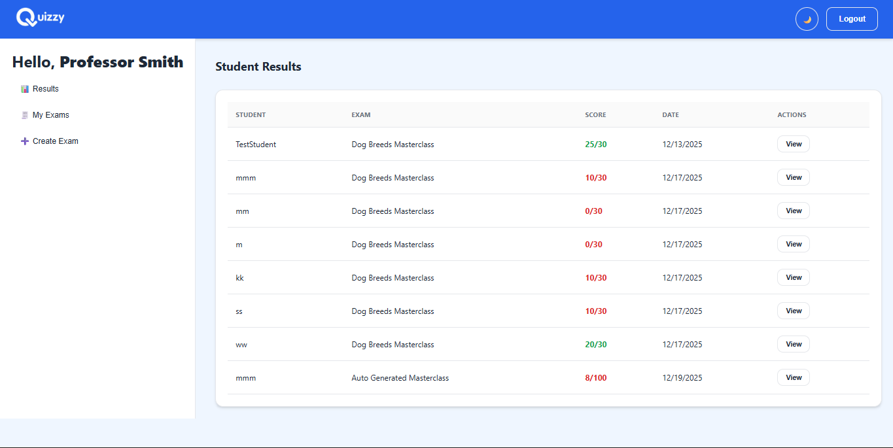
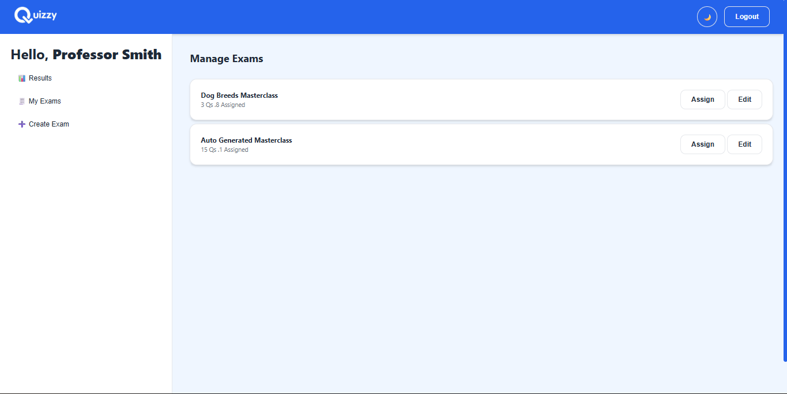
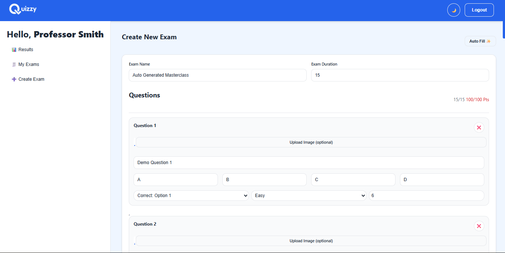
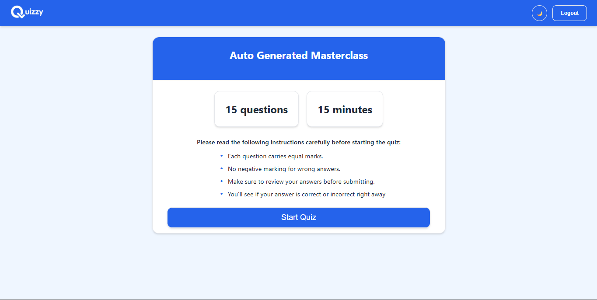
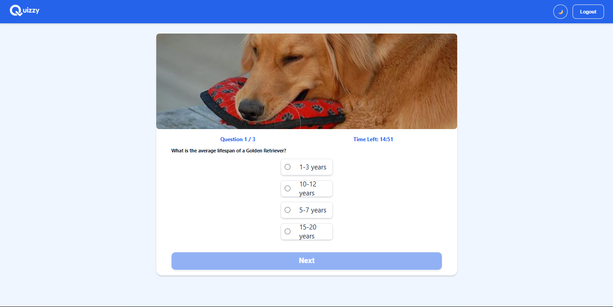
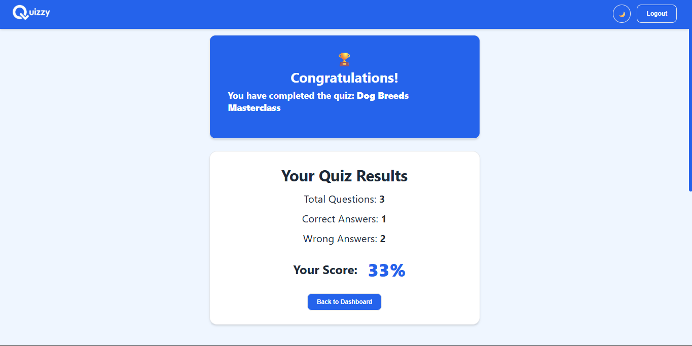
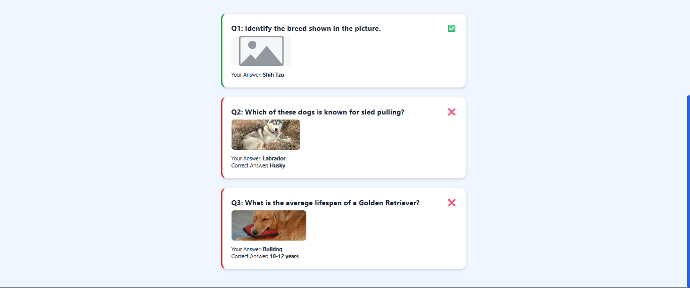

# Quizzy 🧠✨

**Quizzy** is a dynamic, web-based quiz management application built with vanilla JavaScript. It features a dual-role system (Teachers & Students) allowing for the creation, assignment, and execution of timed quizzes with a persistent data layer using `localStorage`.

## 🚀 Features

### 👨‍🏫 For Teachers

- **Dashboard:** Central hub to manage exams and view student performance.
- **Create & Edit Exams:**
- Build exams with custom titles and durations.
- Add multiple-choice questions with different difficulty levels (Easy, Medium, Hard).
- **Image Support:** Upload images for questions (integrated with Cloudinary).
- **Auto-Fill:** Quickly generate demo questions for testing.
- **Validation:** Ensures exams meet standards (e.g., total score = 100, minimum 15 questions).

- **Assign Exams:** Search for registered students and assign specific exams to them.
- **Analyze Results:** View a table of student grades and drill down into detailed reports to see exactly which questions a student missed.

### 👩‍🎓 For Students

- **Dashboard:** Track progress with stats like "Quizzes Taken" and "Average Score."
- **Take Quizzes:**
- Timed examination interface.
- Randomized question and answer order to prevent cheating.
- Responsive design for taking quizzes on different devices.

- **Immediate Feedback:** Instantly view scores and review correct/incorrect answers upon completion.
- **History:** Access a log of all completed quizzes and review past performance.

### ⚙️ General

- **Authentication:** Secure login and registration flows for students and teachers.
- **Dark Mode:** Toggle between Light and Dark themes.
- **Responsive Design:** Optimized for desktop, tablet, and mobile views.
- **Data Persistence:** All data (users, exams, results) is saved locally in the browser.

---

## 🛠️ Tech Stack

- **Frontend:** HTML5, CSS3 (CSS Variables, Flexbox/Grid)
- **Logic:** Vanilla JavaScript (ES6 Modules, Classes)
- **Storage:** Browser `localStorage` (No backend database required)
- **Services:** Cloudinary API (for image uploads)

---

## 📂 Project Structure

```text
/quizzy
├── index.html                  # Landing Page (Student Login)
├── assets/                     # Images and Icons
├── styles/                     # CSS Stylesheets
│   ├── main.css                # Global styles & variables
│   ├── teacher-dashboard.css   # Teacher-specific styles
│   ├── student-quiz-style.css  # Quiz interface styles
│   └── ...
├── views/                      # HTML Pages
│   ├── register.html           # Student Registration
│   ├── teacher-login.html      # Teacher Login
│   ├── student-dashboard.html  # Student Dashboard
│   ├── teacher-dashboard.html  # Teacher Dashboard
│   ├── quiz-questions.html     # Active Quiz Interface
│   └── ...
└── scripts/                    # JavaScript Logic
    ├── app.js                  # Main entry point & routing
    ├── data/                   # Initial seed data
    ├── models/                 # Data models (User, Exam, Result, etc.)
    ├── services/               # Auth, Storage, & Image services
    └── controllers/            # Logic for specific views

```

---

## 🚀 Getting Started

Since Quizzy uses ES6 modules, it must be served via a local server (opening `index.html` directly as a file will cause CORS errors).

1. **Clone or Download** the project folder.
2. **Start a Local Server**:

- If you use VS Code, install the **Live Server** extension and click "Go Live".
- Or using Python: `python -m http.server` inside the project directory.
- Or using Node/NPM: `npx serve`.

3. **Open the App**: Navigate to `http://127.0.0.1:5500` (or your server's port).

---

## 🔑 Demo Credentials

The application comes pre-loaded with the following users (defined in `scripts/data/initial_data.js`):

### **Teacher Accounts**

| Username        | Password | Subject |
| --------------- | -------- | ------- |
| **Teachereman** | `123`    | Zoology |
| **Mr.Science**  | `456`    | Botany  |

### **Student Account**

| Username        | Password |
| --------------- | -------- |
| **TestStudent** | `123`    |

_(You can also register new student accounts via the "Create Student Account" link on the login page.)_

---

## 📸 Screenshots

## 📸 Screenshots

  
  
  
  
  
<table align="center">
    <tr>
        <td colspan="5" align="center">
            <h3>Dashboards</h3>
            <p>Distinct interfaces for teachers to manage content and students to track progress.</p>
        </td>
    </tr>
    <tr>
        <td></td>
        <td></td>
        <td></td>
        <td></td>
        <td></td>
    </tr>
    <tr>
        <td colspan="5" align="center">
            <h3>Quiz Interface</h3>
            <p>Clean, focused layout with a countdown timer and progress tracking.</p>
        </td>
    </tr>
    <tr>
        <td colspan="2" align="center"></td>
        <td colspan="3" align="center"></td>
    </tr>
    <tr>
        <td colspan="5" align="center">
            <h3>Results</h3>
            <p>Detailed breakdown showing user answers vs. correct answers.</p>
        </td>
    </tr>
    <tr>
        <td colspan="3" align="center"></td>
        <td colspan="2" align="center"></td>
    </tr>
</table>

---

## 🛡️ License

This project is open-source and available for educational purposes.
